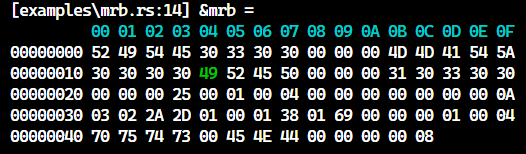

# bytecode

This library provides the ability to read bytecode.
Note that the emphasis is not on performance.

## Usage

Add this to your `Cargo.toml`:
```toml
bytecode = { git = "https://github.com/NaokiM03/bytecode", rev = "a095542" }
```

and this to your source code:
```rust
use bytecode::ByteCode;
```

## Example

```rust
use bytecode::ByteCode;

fn main() {
    let mut bytes: ByteCode = vec![
        0x66, 0x6f, 0x6f, 0x62, 0x61, 0x72, 0xff, 0xff, 0xff, 0xff, 0xff, 0xff,
    ]
    .into();

    assert_eq!(bytes.peek(3), [0x66, 0x6f, 0x6f]);
    assert!(bytes.start_with("foo".as_bytes()));

    bytes.next();
    assert!(bytes.start_with("oo".as_bytes()));
    bytes.skip(2);

    assert_eq!(bytes.take(3), "bar".as_bytes());

    assert_eq!(bytes.take_into_u16(), u16::MAX);
    assert_eq!(bytes.take_into_u32(), u32::MAX);
}
```

```rust
use std::fs::File;
use std::io::Read;

use bytecode::ByteCode;

fn main() {
    let mut f = File::open("./examples/puts.mrb").unwrap();
    let mut buffer = Vec::new();
    f.read_to_end(&mut buffer).unwrap();

    let mut mrb: ByteCode = buffer.into();

    let _header = mrb.take(20);
    dbg!(&mrb);
}
```



## License

`bytecode` is released under the MIT License.
